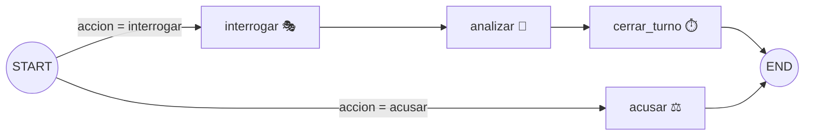

# 🛰️ El Caso Calafate

Juego de misterio por interrogatorios en la terminal. Vos sos el detective;
tres sospechosos — interpretados por un LLM — esconden lo que pasó la noche en
que alguien saboteó el satélite CALAFATE-1 en Bariloche. Tenés 15 preguntas
para juntar pistas y una sola oportunidad de acusar.

Abajo del capó es un proyecto didáctico de **LangGraph + LangChain**: un grafo
con ruteo condicional, estado persistente con checkpointer, salida
estructurada y streaming, todo testeado sin gastar un token.

```
(12❓) Marta › ¿Perdiste tu tarjeta de acceso, no?

Marta Iriarte — Lo... sí. Perdí mi tarjeta el jueves. No lo reporté: perderla
es una falta grave, ¿entiende? Pero yo no entré a la sala limpia anoche.

╭─────────────────────────── 🔎 Nueva pista ───────────────────────────╮
│ La tarjeta que abrió la sala limpia a las 03:02 no la tenía Marta:   │
│ la perdió el jueves y no lo reportó.                                 │
╰──────────────────────────────────────────────────────────────────────╯
```

> ⚠️ **Spoiler**: los datos de `src/caso_calafate/caso.py` revelan al culpable.
> Jugá una partida antes de leer el código. :)

## Cómo jugar

Requisitos: [`uv`](https://docs.astral.sh/uv/). Nada más — uv se encarga de
Python y de las dependencias.

```bash
uv sync
cp .env.example .env   # elegí el motor LLM acá (ver opciones abajo)
uv run detective
```

Motores disponibles (variable `DETECTIVE_MODEL` en el `.env`):

| Valor | Qué necesita | Cómo se juega |
|---|---|---|
| `anthropic:claude-opus-4-8` | `ANTHROPIC_API_KEY` | La mejor actuación de los personajes. Una partida completa cuesta ~US$ 0,50 (con `claude-haiku-4-5`, ~US$ 0,10). |
| `ollama:llama3.1:8b` | `ollama serve` corriendo y el modelo bajado (`ollama list`) | Gratis y local. Actuación más rústica pero jugable. |
| `fake` | Nada | Sin LLM: respuestas enlatadas y pistas que se revelan solas. Para probar la mecánica y para los tests. |

### Comandos dentro del juego

| Comando | Qué hace |
|---|---|
| `/sospechosos` | Quiénes son y qué dicen haber hecho esa noche |
| `/hablar <nombre>` | Elegir a quién interrogar (acepta prefijos: `/hablar mar`) |
| *escribir texto* | Hacerle una pregunta al sospechoso elegido (gasta 1 de las 15) |
| `/pistas` | Tu libreta de pistas descubiertas |
| `/caso` | Releer el briefing |
| `/acusar <nombre>` | Señalar al culpable — cierra la partida, **una sola oportunidad** |
| `/salir` | Abandonar el caso |

## La interfaz web: el escritorio del detective

El mismo motor, otra piel — tal como promete el docstring de `cli.py`:

```bash
uv run detective-web    # y abrí http://127.0.0.1:8765
```

Sos el detective frente a tu escritorio: el interrogatorio se ve por un
monitor CRT (la cámara de la sala), las pistas caen en una libreta
manuscrita, hay un tablero de corcho donde conectás la evidencia con hilo
rojo, la acusación se estampa con un sello, y el veredicto sale en la tapa
del diario del día siguiente. Con lluvia patagónica de fondo — todo el sonido
está sintetizado con Web Audio, no hay un solo archivo de audio.

Qué mirar del lado técnico:

- **El motor no cambió.** `web/servidor.py` es el gemelo de `cli.py`: REST
  para lo informativo (como `/pistas` o `/caso`, lee estado con
  `aget_state()`) y un WebSocket por partida para las jugadas, que streamea
  los tokens del actor al browser con el mismo `stream_mode="messages"`.
- **Partidas guardadas.** `SqliteSaver` (bueno, su versión async) reemplaza a
  `MemorySaver`: cada expediente es un `thread_id` en `partidas.sqlite`, y se
  retoma desde el archivo de casos. El registro de nombres y el tablero viven
  en una tabla propia dentro del mismo archivo (`web/partidas.py`).
- **DTOs anti-spoiler.** El browser es territorio del jugador (F12 mediante):
  los modelos de respuesta filtran `es_culpable`, los secretos y el epílogo,
  que recién viaja cuando la partida se cierra. Hay un test que lo garantiza.
- **Frontend artesanal.** HTML/CSS/JS sin frameworks ni build step, servido
  por el mismo proceso. Los retratos son SVG dibujados a mano, las texturas
  (madera, papel, corcho, nieve del CRT) son gradientes + `feTurbulence`, y
  el revelado tipo teletipo desacopla el reloj de la red del de la pantalla
  (`estatico/js/crt.js`).

## Cómo funciona

Cada turno del juego es **una invocación del grafo**. El CLI arma la jugada
(`interrogar` o `acusar`), el grafo la procesa y el checkpointer guarda la
partida para el turno siguiente:



- **interrogar** — el LLM *actor* responde en personaje, con el historial de
  ese sospechoso y un system prompt armado desde los datos del caso.
- **analizar** — un segundo rol de LLM, el *analista*, lee la respuesta y
  decide con **salida estructurada** (un modelo Pydantic) qué secretos se
  revelaron. El nodo filtra alucinaciones y repetidos.
- **cerrar_turno** — descuenta la pregunta. Determinista, sin LLM.
- **acusar** — compara acusado vs. culpable y cierra la partida.

### Mapa del código (en orden de lectura sugerido)

| Archivo | Qué es | Concepto que muestra |
|---|---|---|
| `caso.py` | Los DATOS del misterio: sospechosos, secretos, textos | Pydantic con validadores (`model_validator`); separar contenido de motor |
| `estado.py` | El estado tipado que fluye por el grafo | `TypedDict` como estado de LangGraph; **reducers** (`Annotated[..., acumular_pistas]`) |
| `prompts.py` | La "dirección de actores": prompts de actor y analista | El contrato de salida estructurada (`SecretosRevelados`) |
| `nodos.py` | Las funciones `estado → actualización` | Nodos testeables; inyección de dependencias; validar lo que dice el LLM |
| `grafo.py` | Ensambla y compila el grafo | `StateGraph`, `add_conditional_edges`, **checkpointer** (`MemorySaver` + `thread_id`) |
| `llm.py` | Fábrica de modelos | `init_chat_model` multi-proveedor; `with_structured_output`; modelos fake |
| `cli.py` | La capa visual (rich) | **Streaming** con `stream_mode="messages"`; leer estado con `get_state()` |
| `web/servidor.py` | La otra capa visual: FastAPI | REST + WebSocket; DTOs anti-spoiler; `astream` y `aget_state` |
| `web/partidas.py` | Registro de partidas guardadas | Convivir con el checkpointer en la misma SQLite |
| `web/estatico/` | El frontend (HTML/CSS/JS a mano) | Streaming por WS; revelado teletipo; texturas con CSS; Web Audio |
| `tests/` | 45 tests que corren en ~2 s | Testear apps LLM **sin LLM**: fakes, caso de juguete, `TestClient` con WebSocket |

## Tests

```bash
uv run pytest        # 45 tests, sin API key, sin red
uv run ruff check .  # lint
```

La idea clave: el grafo recibe el actor y el analista **por parámetro**
(inyección de dependencias), así que los tests enchufan modelos falsos de
LangChain y prueban la lógica completa — ruteo, checkpointer, acumulación de
pistas, veredictos — en milisegundos. Además usan un caso de juguete propio
(«¿Quién se comió el asado?»), de modo que editar El Caso Calafate no rompe
ningún test del motor.

## Ideas para extender (ejercicios)

De más fácil a más difícil:

1. **Escribí tu propio caso.** Es solo agregar datos en `caso.py` — los
   validadores te avisan si te olvidás del culpable. Después hacé que el CLI
   permita elegir caso.
2. **Pistas falsas.** Agregale a `Secreto` un campo `es_pista_falsa` y que la
   libreta las marque distinto cuando se descubre la verdad.
3. **Careo.** Un comando `/carear <a> <b>` donde un sospechoso reacciona a lo
   que dijo otro (necesita pasar fragmentos de una conversación a otra).
4. ~~**Partidas guardadas.**~~ Resuelto en la interfaz web (`web/partidas.py` +
   `AsyncSqliteSaver`). Queda para el CLI: agregá `--partida <nombre>` usando
   el mismo `thread_id` contra la misma base.
5. ~~**Interfaz web.**~~ ¡Hecha! (`web/`). Para seguirla: un **modo
   espectador** — otra pestaña abierta en la misma partida que mire el
   interrogatorio en vivo (el `thread_id` ya lo permite; falta que el server
   reparta los fragmentos a más de un socket).
